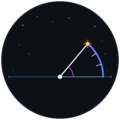
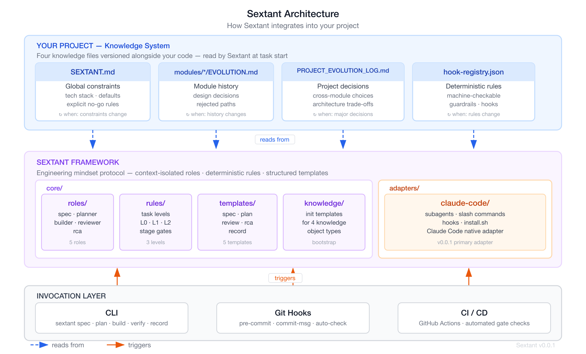
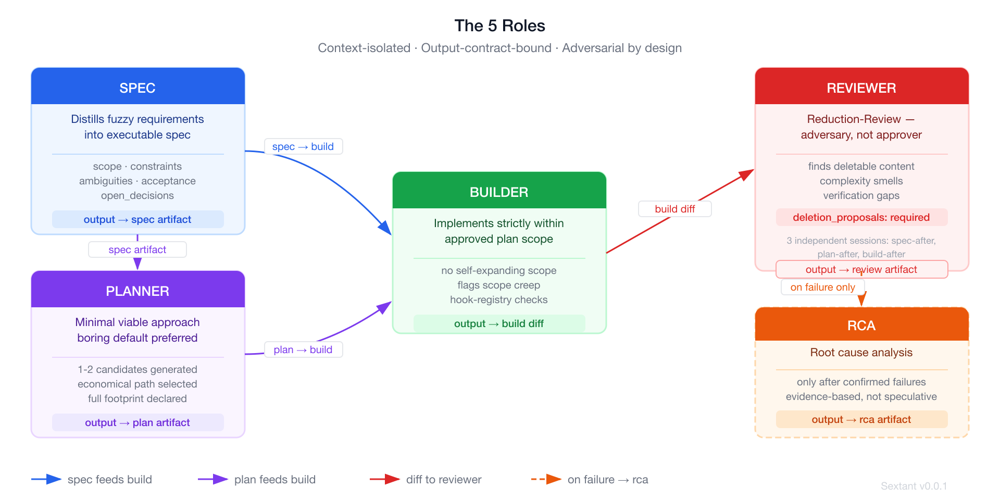
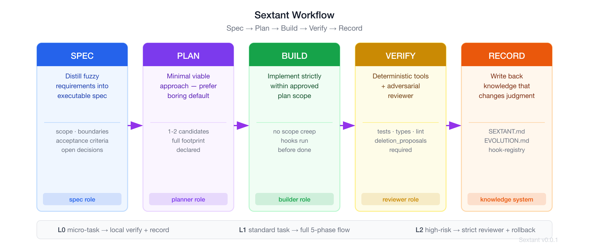

[中文文档](README.zh.md)

<div align="center">



<h1>Sextant</h1>

<p><strong>An engineering mindset framework that tells you where you are when coding with AI.</strong></p>

<p>
  <a href="https://github.com/SaoNian/Sextant/stargazers"></a>
  <a href="LICENSE"></a>
  
  
</p>

</div>

---

A nautical sextant doesn't make the ship faster — it tells the captain exactly where the ship is at every critical decision point. Without it, you're navigating by feel.

Sextant does the same for AI-assisted coding.

AI-generated code looks correct line by line. Tests pass. Everything seems fine. But you don't know if you've drifted — whether the abstraction is over-engineered, whether the implementation has diverged from the spec, whether you're paying the cost of imagined future requirements.

**Sextant is not a tool to make AI smarter or make you code faster. It's a tool that tells you whether you're still on course at every critical decision point.**

---

## The Problem

You're building a feature with Claude Code. You write the spec in your head, ask the AI to implement it, the tests pass, and it looks clean. Three days later:

- A second AI session re-introduces an abstraction you already rejected
- The implementation has three more files than the plan called for
- The reviewer (you, running on empty) approved a diff that solved the wrong problem

This isn't a model capability problem. Claude, GPT, Gemini — they're all capable. They just lack **engineering judgment** baked into the workflow.

Four real failure modes:

| Failure                                    | What Happens                                                                                                                                       |
| ------------------------------------------ | -------------------------------------------------------------------------------------------------------------------------------------------------- |
| **No project-wide view**                   | Each session treats tasks as islands. Naming drift, duplicate logic, architectural contradictions accumulate silently.                             |
| **Over-engineering by default**            | Models slide toward "more complete" practice: extra abstraction layers, more files, more extension points. Each looks reasonable in isolation.     |
| **Self-writing, self-testing blind spots** | The same mental flow writes the spec, designs the solution, implements, then validates it. You get self-consistency, not independent verification. |
| **Context amnesia**                        | A new session doesn't know where the project evolved to, what the last task did, why something was designed this way.                              |



---

## How It Works

Sextant externalizes engineering discipline into a runtime protocol: five context-isolated roles, five phases, and a knowledge system that only keeps what would change a current engineering judgment.

### 5 Roles



| Role         | Responsibility                                                                                  | Key Contract                                                                                                                         |
| ------------ | ----------------------------------------------------------------------------------------------- | ------------------------------------------------------------------------------------------------------------------------------------ |
| **spec**     | Distills fuzzy requirements into an executable spec with explicit scope and acceptance criteria | Produces: scope, constraints, ambiguities, acceptance criteria, open decisions                                                       |
| **planner**  | Proposes the minimal viable approach, prefers boring defaults, avoids over-building             | Generates 1–2 candidates, selects the most economical path, declares full footprint                                                  |
| **builder**  | Implements strictly within the plan's declared scope                                            | Flags scope creep rather than committing it; runs hook-registry checks before declaring done                                         |
| **reviewer** | **Reduction-Review** — adversary, not approver                                                  | `deletion_proposals` is a required field. If nothing can be deleted, explicitly write `none`. Reviewer sees products, not reasoning. |
| **rca**      | Root cause analysis                                                                             | Only appears after confirmed failures, rework events, or incidents — never speculatively                                             |

> The reviewer runs in **three independent sessions**: after spec, after plan, after build. Each is a fresh adversarial context that only receives the upstream structured artifact — never the reasoning process that produced it.

### 5 Phases



**Spec → Plan → Build → Verify → Record**

Verify is a phase, not a role. It's owned by the deterministic toolchain (tests, types, lint, hooks) plus the reviewer examining the diff. Not by the same agent that wrote the code.

### 3 Task Levels

Tasks are classified at the start. Levels only escalate, never downgrade:

| Level                   | Triggers                                                       | Required Flow                       |
| ----------------------- | -------------------------------------------------------------- | ----------------------------------- |
| **L0** — micro-task     | Text changes, style fixes, low-risk tiny bugs                  | Local verify + record               |
| **L1** — standard task  | New page, one API endpoint, small-scope module change          | Full 5-phase flow                   |
| **L2** — high-risk task | Data model changes, auth/payment/sync, architecture migrations | Strict reviewer + rollback thinking |

Override with `--force-l0`, `--force-l1`, or `--force-l2`.

### Knowledge System

Four knowledge files live in your project, versioned alongside your code. Each has a defined invalidation condition so the system stays lean — it's not an archive:

| File                       | Invalidated When                         | Content                                               |
| -------------------------- | ---------------------------------------- | ----------------------------------------------------- |
| `SEXTANT.md`               | Technical constraints change             | Current stack, explicit no-go rules, defaults         |
| `modules/*/EVOLUTION.md`   | Module history path changes              | Design decisions, rejected paths, accepted trade-offs |
| `PROJECT_EVOLUTION_LOG.md` | Project-level long-term decisions update | Cross-module choices, architecture trade-offs         |
| `hook-registry.json`       | The rule itself changes                  | Machine-checkable guardrails, deterministic gates     |

**Principle:** Only keep content that would change a current engineering judgment. Not an archive.

---

## Design Principles

1. **Concentrate verification density at the smallest artifact.** Every token spent validating a spec prevents dozens of tokens of wrong code downstream. Validate specs, not implementations.

2. **Adversarial structure over model count.** True adversarial review comes from context isolation + responsibility isolation + output contract isolation. Independent of model brand.

3. **Deterministic logic before LLM.** Task classification, tool gating, state transitions: deterministic first. LLM only where genuine judgment is needed.

4. **Verification independence from "looking at products, not reasoning."** The reviewer receives only upstream structured output — never the reasoning process or intermediate drafts.

5. **Every layer must be retirable.** Sextant serves the capability gap of 2026. Each mechanism can be independently disabled as models improve. This is health, not failure.

---

## Quick Start with Claude Code

**Requirements:** Claude Code CLI or desktop app.

```sh
# Clone Sextant
git clone https://github.com/SaoNian/Sextant
cd Sextant

# One-shot install: agents, commands, knowledge files, CLAUDE.md snippet
./adapters/claude-code/install.sh --project \
  --path /path/to/your-project \
  --bootstrap \
  --with-snippet
```

Then start your first task in Claude Code:

```
/sextant "describe what you want to build"
```

That's it. `/sextant` runs Spec, Plan, Build, Verify, and Record — pausing only at
meaningful decision points. On a normal L1 task, three `/sextant` invocations complete
the full cycle.

For explicit stage control or L2 tasks (data model, auth, payment):

```
/sextant-spec     # define scope and acceptance criteria
/sextant-plan     # choose the minimal implementation approach
/sextant-build    # implement within the approved plan
/sextant-verify   # run tools + adversarial review
/sextant-record   # write back knowledge, close the task
/sextant-status   # see current stage, blockers, and next action
```

Each `record` updates the project knowledge files (`SEXTANT.md`, `EVOLUTION.md`,
`hook-registry.json`); the next task's `spec` loads them — this is the loop that
prevents context amnesia across sessions.

See `docs/quickstart.md` for a step-by-step walkthrough.

---

## Status

**v0.0.3** — Claude Code adapter usability release.

| Component               | Status                                                                      |
| ----------------------- | --------------------------------------------------------------------------- |
| `core/roles/`           | 5 role prompts (reviewer, spec, planner, builder, rca)                      |
| `core/templates/`       | 5 output templates                                                          |
| `core/rules/`           | Task classification, stage gates, rollback rules                            |
| `core/knowledge/`       | 4 knowledge file initialization templates                                   |
| `adapters/claude-code/` | `/sextant` primary command, 5 stage commands, `/sextant-status`, hooks (advisory/team/strict), one-shot install |
| `scripts/bootstrap.sh`  | Knowledge layout initializer                                                |

Generic CLI and Trace system planned for v0.2.

---

## License

MIT
